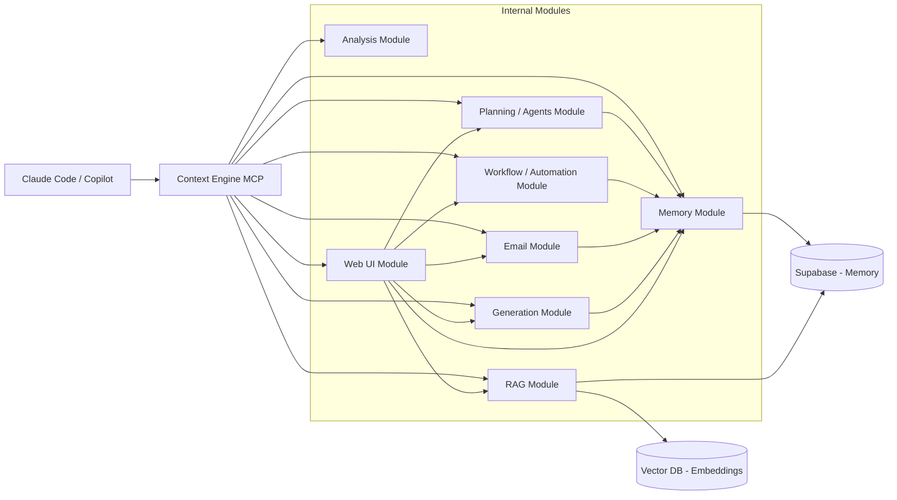

# Context Engine MCP

A context-first system that gives persistent memory, semantic understanding, autonomous agents, workflow automation, and content generation to AI coding tools like Claude Code and Copilot, with a web UI for full visibility.

---

## Overview

AI coding tools often lack **stateful context**. This system transforms them into **context-aware collaborators**.

Key capabilities:

* Persistent developer memory
* Semantic knowledge retrieval (RAG)
* Context-aware code analysis
* Autonomous task execution (agents)
* Workflow automation
* Email processing → tasks & summaries
* LinkedIn / content generation
* Unified web UI

---

## Architecture



---

## Internal Modules & Features

### 1. Memory Module

* Stores tasks, meetings, decisions, projects, notes, people, tags, status
* Provides structured, persistent retrieval for AI tools

### 2. RAG Module

* Embeddings-based semantic search
* Retrieve relevant past work, documents, and notes
* Integrates with Memory and Vector DB

### 3. Analysis Module

* Codebase inspection & suggestions
* Context-aware insights using Memory + RAG
* Detect patterns, refactoring opportunities, technical debt

### 4. Planning / Agents Module

* Break goals into actionable tasks
* Autonomous execution (multi-agent)
* Tracks task status & execution logs
* Suggests next actions

### 5. Workflow / Automation Module

* Event-driven pipelines
* Trigger-action rules for tasks, analysis, and agents
* Executes workflows automatically
* Integrates with Memory, Agents, and RAG

### 6. Email Module

* Ingest emails from multiple accounts
* Summarize emails
* Extract tasks & create Memory entries automatically
* Link emails to projects / people

### 7. Generation Module

* Generate LinkedIn posts, summaries, or insights
* Converts real work into content
* Can use historical data from Memory and RAG

### 8. Web UI Module

* Unified interface to view:

  * Tasks, meetings, projects
  * Email summaries
  * Agents & workflows
  * Memory search
  * Generated posts
* Real-time updates
* Interactive: execute tools directly from UI

---

## MCP Tools Exposed

```ts
add_memory(input)
search_memory(query)
query_context(question)
analyze_project(path)
plan_task(goal)
run_workflow(workflow_id)
read_email(account)
summarize_email(email_id)
generate_posts(topic)
```

---

## Example Flows

### Query Past Work

```text
What did I work on last week?
```

→ Memory + RAG → contextual response

### Analyze Project

```text
Analyze my backend based on past decisions
```

→ Analysis + Memory → suggestions

### Plan Next Steps

```text
What should I do next on this project?
```

→ Planning/Agents + Memory → action plan

### Automate Task

```text
Whenever a new email arrives, extract tasks automatically
```

→ Workflow + Email + Memory → task creation

### Generate LinkedIn Content

```text
Create 5 posts summarizing my recent work
```

→ Generation + Memory → ready-to-post content

### Use Web UI

* Visualize memory, agents, workflows, emails, posts
* Trigger tools manually
* Search semantic context

---

## Installation

### Requirements

* Node.js >= 20
* pnpm >= 9
* Supabase project (see `.env.example`)

### Setup

```bash
# Clone and install
git clone <repo>
cd project-ai-system
pnpm install

# Copy env and fill in your Supabase credentials
cp .env.example .env

# Apply database schema (requires psql)
psql "$SUPABASE_DB_URL" -f db/schema.sql

# Deploy the embed edge function
supabase functions deploy embed --project-ref <your-ref> --no-verify-jwt

# Build all packages
pnpm build
```

### Run Web UI

```bash
pnpm --filter @context-engine/web-ui dev
# → http://localhost:3000
```

---

## Testing the MCP Server

### Option 1 — Claude Code CLI (recommended)

Build the server and add it to your Claude Code config:

```bash
pnpm --filter @context-engine/mcp-server build
```

Add to `~/.claude/settings.json` (or `.mcp.json` in your project root):

```json
{
  "mcpServers": {
    "context-engine": {
      "command": "node",
      "args": ["/absolute/path/to/project-ai-system/packages/mcp-server/dist/index.js"],
      "env": {
        "SUPABASE_URL": "your-supabase-url",
        "SUPABASE_SERVICE_KEY": "your-service-role-key"
      }
    }
  }
}
```

Then open Claude Code — the tools will be available automatically.

### Option 2 — MCP Inspector (visual debug UI)

Faster for testing individual tools without Claude Code:

```bash
SUPABASE_URL=your-url \
SUPABASE_SERVICE_KEY=your-service-key \
npx @modelcontextprotocol/inspector \
  node packages/mcp-server/dist/index.js
```

Open `http://localhost:5173` → call any tool from the visual interface.

### Available MCP Tools

| Tool | Description |
|------|-------------|
| `add_entry` | Add a memory entry (task, note, decision, meeting, idea, log) |
| `get_entries` | Retrieve entries with filters (type, project, tags, status, date) |
| `update_entry` | Update entry status, content or tags |
| `search_memory` | Semantic search via RAG (cosine similarity) |
| `query_context` | Ask a question — returns formatted context for Claude |
| `add_project` | Register a project |
| `get_projects` | List projects |
| `add_person` | Add a person (team member, client, contact) |
| `get_people` | List people |

### Example queries in Claude Code

```
What did I work on this week?
→ uses query_context

Add a note: decided to use Supabase for the DB, reason: simplicity
→ uses add_entry

Show all blocked tasks for project X
→ uses get_entries
```

---

## Run Web UI

```bash
cd packages/web-ui
pnpm dev
# → http://localhost:3000
```

---

## Project Structure

```text
/project-ai-system
  /packages
    /mcp-server        ← MCP tools exposed to Claude Code
      /src
        /tools         ← entries, search, projects, people
        /lib           ← supabase client, helpers, embed
    /web-ui            ← Next.js 16 dashboard (Digital Control Room)
    /shared            ← shared TypeScript types + Zod schemas
  /db
    schema.sql         ← full Supabase schema (pgvector)
    /migrations
  /supabase
    /functions
      /embed           ← Deno edge function: gte-small embeddings (free)
  /docs
    v1.md              ← V1 spec
    design.md          ← frontend design system
  .env.example
  .mcp.json            ← Claude Code MCP config template
  pnpm-workspace.yaml
```

---

## Tech Stack

| Layer | Technology |
|-------|-----------|
| MCP Server | Node.js + TypeScript + `@modelcontextprotocol/sdk` |
| Database | Supabase (PostgreSQL + pgvector) |
| Embeddings | Supabase Edge Function — `gte-small` (384 dims, free) |
| Web UI | Next.js 16 + Tailwind v4 + Framer Motion + AOS |
| Shared Types | TypeScript + Zod (pnpm workspace) |
| Package Manager | pnpm workspaces |

---

## Design Principles

* **Context-first** → Memory is core
* **MCP-native** → Tools exposed to AI seamlessly
* **Modular internally** → Each feature is a module
* **User-owned data** → Supabase DB controlled by user
* **Composable intelligence** → Modules enhance each other

---

## Use Cases

* Persistent AI context for developers
* Context-aware code analysis
* Task planning & automation
* Semantic search across projects
* Automated email-to-task pipelines
* LinkedIn / knowledge sharing
* Unified Web UI to monitor activity and insights

---

## Roadmap

* Advanced semantic ranking & cross-project linking
* Real-time updates across modules
* Team-level shared memory
* Plugin system for new tools
* Mobile-friendly Web UI

---

## Vision

Turn AI coding assistants into **context-aware collaborators** that understand history, projects, and priorities — all in one unified platform.

---

## Author

Full-stack developer transitioning to AI Agent Engineering, focused on building modular, context-first systems.

---

## License

MIT
